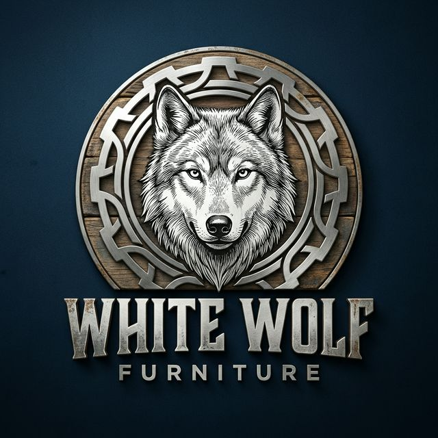

# White Wolf Furniture 🐺🪑

> **Artisanal Industrial Furniture | Delta State, Nigeria**

White Wolf Furniture is a premium, high-end landing page for a bespoke carpentry and industrial design workshop. This project showcases the mastery of Mr. Friday Igbunu Kelvin, bridging the gap between raw industrial utility and breathtaking artisanal elegance.



## ✨ Core Features

- **💎 Advanced Glassmorphism**: A state-of-the-art design system across the entire site, featuring frosted glass cards, navigation, and input fields.
- **📱 HD Product Lightbox**: Interactive product gallery with high-definition detail views and zoom capabilities.
- **⚡ Cinematic Scroll Reveals**: Hardware-accelerated entrance animations for a dynamic, premium exploration experience.
- **🎨 Master Artisan Showcase**: Dedicated "Meet the Maker" section detailing the workshop's history and achievements.
- **📥 Quote Request System**: Functional inquiry modal with real-time state management powered by Nanostores.
- **📞 Direct Lead Generation**: Integrated physical address and "Call Direct" functionality for immediate business conversion.

## 🛠 Tech Stack

- **Framework**: [Astro 5](https://astro.build/) (Static Site Generation)
- **UI Logic**: [React](https://reactjs.org/) (Client-side interactive islands)
- **Styling**: [Tailwind CSS V4](https://tailwindcss.com/) + Custom Glassmorphism Utilities
- **Animations**: [Framer Motion](https://www.framer.com/motion/) + Intersection Observer API
- **State Management**: [Nanostores](https://github.com/nanostores/nanostores)
- **Icons**: [Lucide React](https://lucide.dev/)

## 🚀 Getting Started

### Prerequisites

- Node.js (v18.14.1 or higher)
- npm (v9.0.0 or higher)

### Installation

1. Clone the repository:
   ```bash
   git clone https://github.com/chimzyfire-ship-it/white-wolf-furniture.git
   ```
2. Install dependencies:
   ```bash
   npm install
   ```
3. Run the development server:
   ```bash
   npm run dev
   ```

### Deployment

This site is optimized for **Vercel** or **Netlify**. Simply connect your GitHub repository to your preferred hosting provider for automatic builds and deployments.

## 📁 Project Structure

```text
/
├── public/              # Static assets (Logo, Textures)
├── src/
│   ├── components/      # Astro & React components
│   ├── data/            # Centralized project & product data
│   ├── layouts/         # Base HTML structures
│   ├── styles/          # Global CSS & Glassmorphism definitions
│   └── pages/           # Site routes (index.astro)
└── PRODUCT_GUIDE.md     # Instructions for manual content updates
```

---

*Crafted with precision by White Wolf Furniture & Antigravity AI.*
